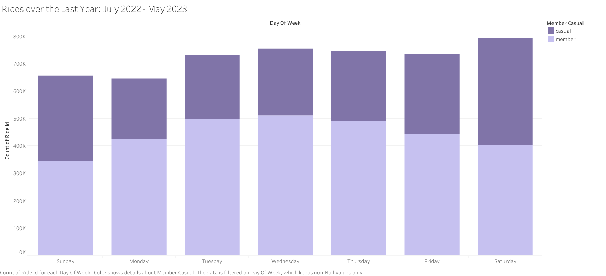
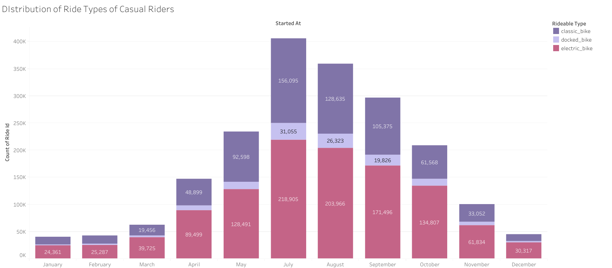

# Cyclistic: Turning casual riders to Cyclistic members
Cyclistic launched a successful bike-share offering. Since then, the program has grown to a fleet of 5,824 bicycles that
are geotracked and locked into a network of 692 stations across Chicago. The bikes can be unlocked from one station and
returned to any other station in the system anytime.
Until now, Cyclistic’s marketing strategy relied on building general awareness and appealing to broad consumer segments.
One approach that helped make these things possible was the flexibility of its pricing plans: single-ride passes, full-day passes,
and annual memberships. Customers who purchase single-ride or full-day passes are referred to as casual riders. Customers
who purchase annual memberships are Cyclistic members.

> Date Completed: 2 August 2023

**Deliverables:**

1. A clear statement of the business task
2. A description of all data sources used
3. Documentation of any cleaning or manipulation of data
4. A summary of your analysis
5. Supporting visualizations and key findings
6. Your top three recommendations based on your analysis


***1- A clear statement of the business task***

Analyse the Cyclistic data set to understand how annual members and casual riders use Cyclistic bikes differently and how can we convert the casual riders into members.

***2- A description of all data sources used***

The dataset consists of the 11 csv files for each month from July 2022 to May 2023. \*This is public data that has been made available by Motivate International Inc. under this [**licence**](https://ride.divvybikes.com/data-license-agreement).

***3- Documentation of any cleaning or manipulation of data***

|**Columns\_id**|Description|
| :- | :- |
|**ride\_id**|Unique id for each bike ride|
|**rideable\_type**|**bike type i.e., docked, electric or classic**|
|**started\_at**|**Start time of ride in the format dd-mm-yy hh:mm:ss**|
|**ended\_at**|**End time of ride in the format dd-mm-yy hh:mm:ss**|
|**start\_station\_name**|**Name of the station ride started from**|
|**start\_station\_id**|**Id of starting station**|
|**end\_station\_name**|**Name of the station ride ended at**|
|**end\_station\_id**|**Id of ending station**|
|**member\_casual**|**Whether the rider was a casual rider or had a membership**|

**MS Excel**

1. Checked and removed duplicates.
1. Trimmed all the extra spaces from all the columns.
1. Created a new column ‘ride\_length’ using the formula = (ended\_at – started\_at).
1. Created a new column ‘day\_of\_week’ using the WEEKDAY() function to check for the day of the week based on the starting date. 

***3- A summary of your analysis***

The dataset for 11 months is immense so we cannot go on about our analysis with just excel. We’ll use SQLite now for further analysis.

**SQL**

Used SQLite. Created 11 tables for each month from July 2022 to May 2023. 
```
/* Combine all the individual months data into year-long one */
CREATE TABLE year_data AS 
    SELECT july22.* FROM  "202207_divvy_tripdata" july22 UNION ALL
    SELECT aug22.* FROM  "202208_divvy_tripdata" aug22 UNION ALL
    SELECT sep22.* FROM  "202209_divvy_publictripdata" sep22 UNION ALL
    SELECT oct22.* FROM  "202210_divvy_tripdata" oct22 UNION ALL
    SELECT nov22.* FROM  "202211_divvy_tripdata" nov22 UNION ALL
    SELECT dec22.* FROM  "202212_divvy_tripdata" dec22 UNION ALL
    SELECT jan23.* FROM  "202301_divvy_tripdata" jan23 UNION ALL
    SELECT feb23.* FROM  "202302_divvy_tripdata" feb23 UNION ALL
    SELECT mar23.* FROM  "202303_divvy_tripdata" mar23 UNION ALL
    SELECT apr23.* FROM  "202304_divvy_tripdata" apr23 UNION ALL
    SELECT may23.* FROM  "202305_divvy_tripdata" may23 
```
Now, we have the year-long data. Let's further analyze it.

Let's have a look at peak months for casual riders.
```
SELECT
	SUBSTR( yd.started_at, 4,2) as month,
	COUNT(yd.ride_id) as number_of_ride
FROM 
	year_data yd
WHERE 
	yd.member_casual = 'casual'
GROUP by
	SUBSTR( yd.started_at, 4,2)
ORDER BY 
	number_of_ride DESC
```
**RESULT**
|month|number_of_ride|
|-----|--------------|
|07|406055|
|08|358924|
|09|296697|
|05|234181|
|10|208989|
|04|147285|
|11|100772|
|03|62201|
|12|44894|
|02|43016|
|01|40008|

>The peak months are July, August and September. Casual riders take most rides in the summer.

```
-- Average ride length for each rider type
SELECT 
	yd.member_casual as 'type',
	time(
          CAST(AVG(strftime('%s', yd.ride_length) * 1000 + SUBSTR(yd.ride_length, -3)) / 1000 AS INTEGER), 
         'unixepoch'
       )  as avg_ride_length
FROM 
	year_data yd 
GROUP BY
	yd.member_casual 

```
**RESULT**
|type|avg_ride_length|
|----|---------------|
|casual|00:20:51|
|member|00:11:57|

 
> We can see that casual riders take longer rides than members. Casual riders have greater average ride_length than the ones with the membership.  


Let's look at the busiest days.
```
-- Total rides for each weekday grouped by rider type
SELECT 
	yd.member_casual,
	yd.day_of_week as weekday,
	COUNT(yd.ride_id) as number_of_rides
FROM 
	year_data yd 
GROUP BY
	yd.member_casual, weekday
ORDER BY
	yd.member_casual, number_of_rides DESC

```
**RESULT**
|member_casual|weekday|number_of_rides|
|-------------|-------|---------------|
|casual|7|390692|
|casual|1|309788|
|casual|6|290690|
|casual|5|255365|
|casual|4|243515|
|casual|3|232153|
|casual|2|220819|
|member|4|510539|
|member|3|497553|
|member|5|491406|
|member|6|444146|
|member|2|424608|
|member|7|403064|
|member|1|345488|


>From the results it is clear that, Saturday is the busiest for casual riders and  Wednesday for members. Casual riders mostly take rides for leisure on the weekends.


Now, let's see if the rides are also the longest on the busiest days.
```	
SELECT 
	yd.member_casual as 'type',
	yd.day_of_week as weekday,
	COUNT(yd.ride_id) as number_of_rides,
	time(
          CAST(AVG(strftime('%s', yd.ride_length) * 1000 + SUBSTR(yd.ride_length, -3)) / 1000 AS INTEGER), 
         'unixepoch'
       )  as avg_ride_length
FROM 
	year_data yd 
GROUP BY
	yd.member_casual,  weekday
ORDER BY
	yd.member_casual, number_of_rides DESC
/*CONCLUSION: 
 * 			 Yes, Saturday is the busiest for casual riders and the rides are also the longest on this day, on average.
 * */
```
**RESULT**
|type|weekday|number_of_rides|avg_ride_length|
|----|-------|---------------|---------------|
|casual|7|390692|00:23:51|
|casual|1|309788|00:24:16|
|casual|6|290690|00:19:57|
|casual|5|255365|00:18:15|
|casual|4|243515|00:17:54|
|casual|3|232153|00:18:33|
|casual|2|220819|00:20:39|
|member|4|510539|00:11:29|
|member|3|497553|00:11:29|
|member|5|491406|00:11:31|
|member|6|444146|00:11:48|
|member|2|424608|00:11:22|
|member|7|403064|00:13:20|
|member|1|345488|00:13:12|


>Yes, Saturday is the busiest for casual riders and the rides are also the longest on this day, on average.

Let's now look at the most frequent stations used by casual riders. We are only looking at casual riders here because they are our target.

```
SELECT 
	yd.member_casual as 'type',
	yd.start_station_name as start_station,
	COUNT(yd.ride_id) as number_of_rides
FROM 
	year_data yd 
WHERE 
	start_station != ''
GROUP BY
	yd.member_casual,  start_station
ORDER BY
	yd.member_casual, number_of_rides DESC
LIMIT 
	3
```
**RESULT**
|type|start_station|number_of_rides|
|----|-------------|---------------|
|casual|Streeter Dr & Grand Ave|46166|
|casual|DuSable Lake Shore Dr & Monroe St|26488|
|casual|Millennium Park|20614|


Okay, what about ending stations?
```
SELECT 
	yd.member_casual as 'type',
	yd.end_station_name as end_station,
	COUNT(yd.ride_id) as number_of_rides
FROM 
	year_data yd 
WHERE 
	end_station != ''
GROUP BY
	yd.member_casual,  end_station
ORDER BY
	yd.member_casual, number_of_rides DESC
LIMIT 
	3
```
**RESULT**
|type|end_station|number_of_rides|
|----|-----------|---------------|
|casual|Streeter Dr & Grand Ave|48176|
|casual|DuSable Lake Shore Dr & Monroe St|24100|
|casual|Millennium Park|22004|


>The top 3 starting and ending stations are the same. 

What bikes our riders use?
```
SELECT
	yd.member_casual,
	yd.rideable_type,
	COUNT(yd.ride_id) as number_of_ride
FROM 
	year_data yd
GROUP by
	yd.member_casual, yd.rideable_type
ORDER BY 
	number_of_ride DESC
```
**RESULT**
|member_casual|rideable_type|number_of_ride|
|-------------|-------------|--------------|
|member|electric_bike|1622803|
|member|classic_bike|1494001|
|casual|electric_bike|1128688|
|casual|classic_bike|687773|
|casual|docked_bike|126561|

> Casual riders and members take the electric bikes most of their rides.

***4- Supporting visualizations and key findings***

I used Tableau for creating the visualizations that support my findings. I uploaded all the csv files to Tableau and then I used union feature to unite all data files into one main data source.

The peak months for casual riders are July, August and September.


 
The busiest day for casual riders is Saturday, and Wednesday for members.



Let's look at the top stations used by casual riders.
 
>Top 3 stations are:
>* Streeter Dr & Grand Ave
>* DuSable Lake Shore Dr & Monroe St
>* Millennium Park

What about which bike type frequently used by our casual riders?



>So, electric bike it is.

***5- Your top recommendations based on your analysis***

1. **Summer Marketing Campaign**: Launch a targeted marketing campaign around summer, as casual riders take most rides during this time. Highlight the benefits of becoming a Cyclistic member, such as exclusive offers, discounts, and perks available during the summer season. Highlighte the availability of electric bikes, especially since casual riders tend to use electric bikes more frequently around this time.  

2. **Weekend Promotion**: Run ads on weekends, as that's when most casual riders take the bikes for leisure activities. Emphasize the convenience and flexibility of Cyclistic membership for weekend getaways and city explorations.

3. **Membership Cost Savings**: Showcase how a membership can save casual riders money in the long run, especially for those who frequently take longer rides. Demonstrate the potential cost savings for frequent riders who opt for annual memberships. Gather positive feedback and testimonials from current Cyclistic members who have experienced the benefits of membership. 

4. **Ads at Top Stations**: Place physical ads at the top three start and ending stations: Streeter Dr & Grand, DuSable Lake Shore Dr & Monroe St, and Millennium Park. Highlight the benefits of membership, such as priority bike availability and faster checkouts, for users starting or ending their rides at these popular locations

